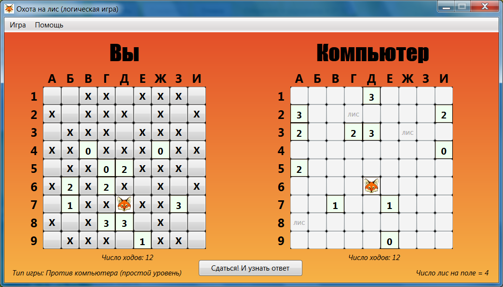
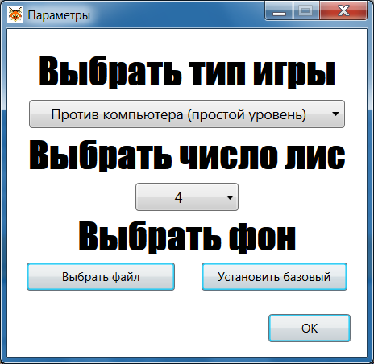
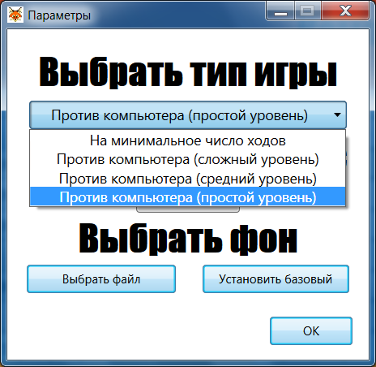
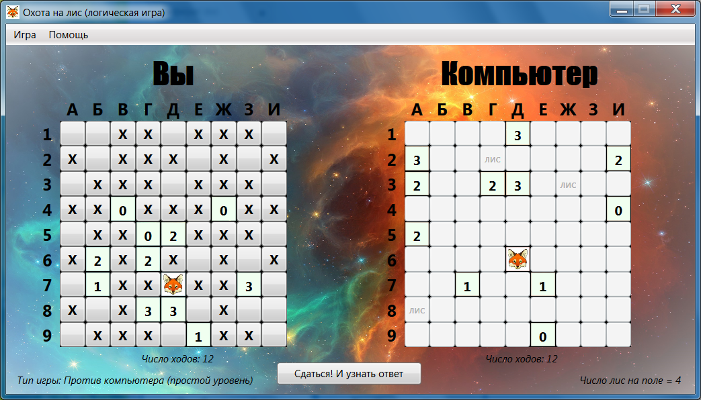
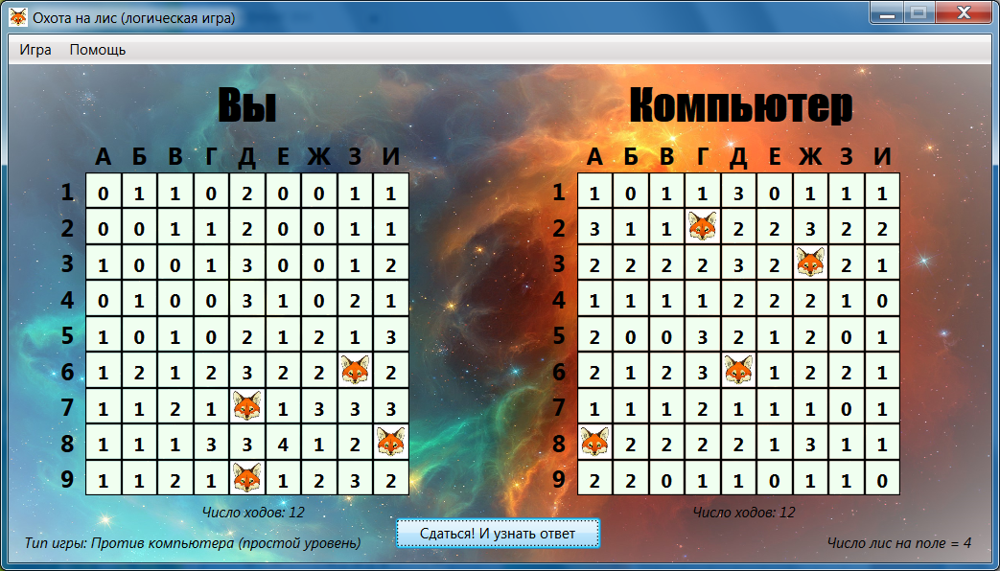
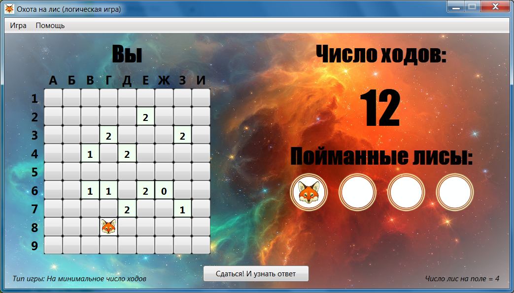

# Логическая игра "Охота на лис", 2017-2018г

Номер регистрации (свидетельства): [2018617542](https://www1.fips.ru/registers-doc-view/fips_servlet?DB=EVM&rn=5985&DocNumber=2018617542&TypeFile=html)

---

### Название программы для ЭВМ:
Программа для ЭВМ «Логическая игра «Охота на лис»»

### Реферат:
Программа реализует логическую игру «Охота на лис», созданную по мотивам радиолюбительской игры по спортивному ориентированию. Пользователю предоставляется на выбор два варианта игры. Первый вариант - игра с противником, в качестве которого выступает компьютер, второй вариант - игра без противника, с целью минимизации числа ходов. Игровое поле представляет собой квадрат 9x9 клеток. На поле располагается фиксированное число лис (от 3 до 8), каждая в отдельной клетке. В случае игры без противника расположение лис определяется случайным образом. В случае игры с противником, каждый игрок формирует свое поле. Один ход (выстрел) либо открывает клетку поля, либо уничтожает лису в клетке поля, открытой предыдущими выстрелами. Игра с противником разделена на 3 уровня сложности: сложный, средний, простой. Параметрами игры являются число лис на поле, сложность, фон игрового поля. Управление игрой осуществляется в первую очередь мышью. Нажатие левой клавиши мыши - добавление лисы на поле в момент его формирования; выстрел на игровом поле, в соответствующей клетке во время хода игры. Нажатие правой клавиши мыши — установка метки о предполагаемом расположении (отсутствии) лисы в соответствующей клетке. Управление параметрами игры осуществляется через главное меню.

### Язык программирования: 
С#

### Объем программы для ЭВМ: 
527 Кб

---

## Интерфейс

Параметры игры после выбора сохраняются в файле, следовательно, при последующем запуске программы все настройки останутся

Фон можно менять

Сдавшись, можно узнать где были загаданы лисы

До этого был тип игры против компьютера. Ниже скриншот игры с типом "на минимальное число ходов"

